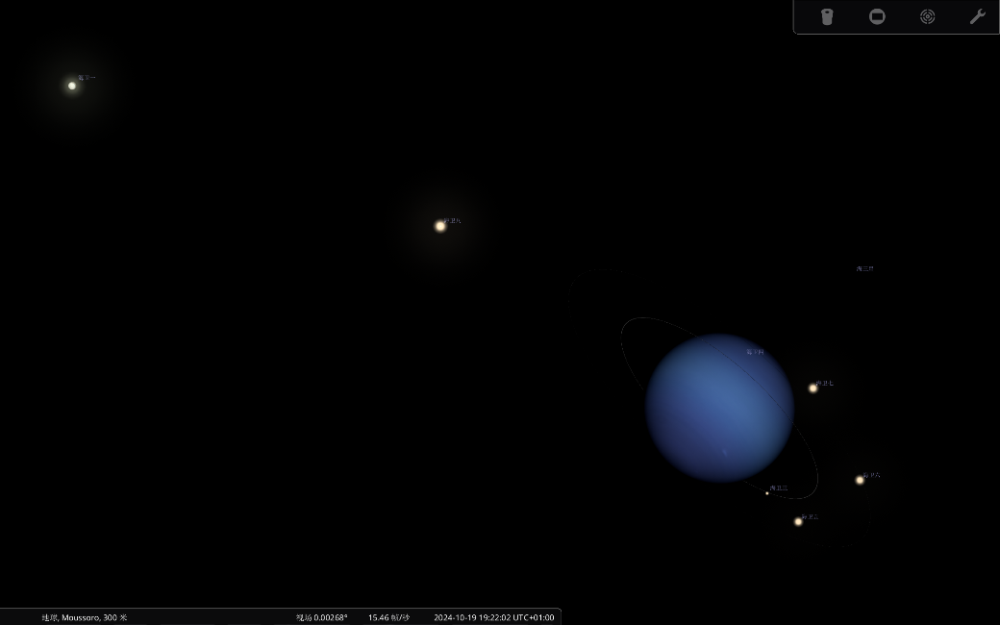

# 

本文旨在探讨研究观测星表的收集和整合工作的流程以及遇到的难点。主要基于J. Desmars和Ye Yuan的两篇文献，剖析构建观测星表过程中的前后流程和操作手法

两篇文献的最大共通点是：在文献发表之前，已经有很多基础文献和观测数据发表，但是通常都以不同的的格式发表。因此他们总结了之前发表的各式目录，检测规范观测目录中的旧数据，整理新发表的新数据，整理成统一制式的观测星表。

## 1\. *基本知识*

理解天文领域的基本常识是开展工作的基础，以下罗列出了在阅读文献中遇到的天文学名词。

儒略日：以连续的日数计算时间的计时法。

坐标单位：以角秒为单位，是测量角度的单位。1°=60角分=3600角秒。

折射：折射是指光通过不同介质（如地球大气层）时路径发生弯曲的现象。在天文观测中，折射会影响观测到的天体位置，因此需要进行校正。

像差：像差是由于光速有限和观测者相对于光源的运动导致观测到的光的方向发生偏移的现象。在天文观测中，像差校正是必要的步骤之一。

相位效应：相位效应是指由于观测天体与观测者、光源（通常是太阳）之间相对位置的变化，导致观测到的天体亮度和形状的变化。

赤经和赤纬：赤经和赤纬是天球坐标系统中的两个坐标，类似于地理坐标系统中的经度和纬度，用于确定天体在天球上的位置。

CCD图像测量：CCD（Charge-Coupled Device）是一种用于检测光的电子设备，常用于天文摄影。CCD图像测量是指使用CCD相机获取的图像来测量天体的位置和亮度。

HST观测：HST（Hubble Space Telescope，哈勃太空望远镜）观测是指使用哈勃太空望远镜进行的天文观测。这种观测可以提供极高分辨率的天体图像。

O-C残差：O-C残差是指观测值与根据动力学模型计算值之间的差异。这些残差用于评估模型的准确性和观测数据的质量。

## 2\. 土卫系统

J. Desmars在A new catalogue of observations of the eight major satellitesof Saturn文中，比较系统的阐述了土星卫星观测星表汇编的主要流程，并且罗列出了较为权威的观测数据的来源。为之后的工作提供了较为准确的研究路线，其主要总结整合出了土星八颗主要卫星的新观测目录，阐述了构建新观测目录的基本逻辑，即收集新数据-整合旧数据-完善缺失数据-矫正处理数据-整合成新观测目录。

### 2.1 目录分类

<table>
<tbody>
<tr class="odd">
<td><strong>目录名称</strong></td>
<td><strong>时间跨度</strong></td>
<td><strong>数据大小</strong></td>
<td><strong>获取方式</strong></td>
</tr>
<tr class="even">
<td>
Strugnell &amp; Taylor catalogue

(ST90)
</td>
<td>1874-1989</td>
<td>约51,000次观测</td>
<td>CDS</td>
</tr>
<tr class="odd">
<td>
Harper &amp; Taylor catalogue

(HT94)
</td>
<td>1894-1922</td>
<td>约15,000次观测</td>
<td>CDS</td>
</tr>
<tr class="even">
<td>
<a href="http://nsdb.imcce.fr/obspos/obsindhe.htm">Natural satellites database center</a>

(NSDC)
</td>
<td>实时增加</td>
<td>—</td>
<td>NSDC</td>
</tr>
<tr class="odd">
<td>The recent observations</td>
<td>1994-2007</td>
<td>近年发布的超9900个新的观测数据</td>
<td>—</td>
</tr>
<tr class="even">
<td>
<a href="https://cdsarc.u-strasbg.fr/viz-bin/cat/J/A+A/493/1183">Catalogue of Observations of Saturnian Satellites</a>

(COSS08)
</td>
<td>1874-2007</td>
<td>是四个不同观测来源的汇编。</td>
<td>CDS</td>
</tr>
</tbody>
</table>

实际上，观测数据最早可以溯源到80年代，甚至在不考虑观测精度的前提下可以追溯到更久，这也就带来了整合旧数据中的第一大难点，即不同年代不同观测站不同人的观测手法、观测范围、观测时间以及得出的数据规模和字段数量都是不一致的。因此如何将不同的观测尺度和数据类型化零为整是决定观测数据是否可用的关键。

在文中的观测数据主要来源于NSDC上已发布的数据，次要来源为ST90和HT94，以及近年发表或收录的新观测数据。以下是对各来源的详细描述。

### 2.2 各分类内容

#### 2.2.1 [NSDB](http://nsdb.imcce.fr/obspos/OBS_COLL/)

The Natural Satellites DataBase (NSDB) 是一个专注于自然行星卫星（不包括月球）的天文数据库，它提供了用于动力学研究和星历表制作的天体测量观测数据。文中涉及的大部分数据来源于IMCCE，即天体力学和星历表计算研究所。

但是NSDC之中的观测数据是分层分段的，例如si0001是包含(helene、Telesto、Calypso)在1982年到1985年在La silla 和Maunakea两个天文台的观测数据，相对NSDC来说是子集和全集的关系。观测的字段类别如下。

| 行星编号 | 儒略日      | x的坐标 | y的坐标 | 坐标系纪元 | x计算差异值 | y计算差异值 | 观测站编号 |
| -------- | ----------- | ------- | ------- | ---------- | ----------- | ----------- | ---------- |
| 12       | 2444704.547 | 42.4    | 7.03    | 1          | 0.183       | 0.435       | 809        |
| 12       | 2444704.583 | 45.65   | 6.9     | 1          | \-0.096     | 0.413       | 809        |

NSDC的优点是即使存在某些数据错误，但是其观测星表数据是按照一定的制式创建的，更加方便统一和整理。而且对应的每一个观测数据都有对应的解释文档。

缺点是即使是按照一定的制式制作的，但是不同年限的数据规模仍有细微的区别，例如ji0008和ji0009是同一个人在同一时间发布的观测数据，但观测的数据类别仍有区别。

<table>
<tbody>
<tr class="odd">
<td><strong>Ji0008 Format</strong></td>
<td><strong>Ji0009 Format</strong></td>
</tr>
<tr class="even">
<td>
1. JD of observation with decimals

2. Right ascension, degres

3. Declination, degres
</td>
<td>
1. JD of observation with decimals

2. Number os satellite, N sat

3. Delta Right ascension, degres*10^5

4. Delta Declination, degres*10^5
</td>
</tr>
</tbody>
</table>

在Contents解释文档中提到了NSDC中的一些差异的计算方法和评估指标。以si001为例，观测值与计算值的差异：提到了使用P. Oberty的理论，由N. Emelianov计算出的观测值（O）与计算值（C）之间的差异，分别在X和Y方向上，记为O-C(X)e和O-C(Y)e。

#### 2.2.2 [ST90](http://cdsweb.u-strasbg.fr/)

ST90目录包含了从1874年到1989年的大约51,000次观测，涵盖了超过3500个观测夜晚。ST90目录中的观测数据以一种一致的格式进行整理，这使得数据可以与理论位置进行比较。ST90目录的观测数据来源多样，包括了不同时期、不同观测者以不同格式发布的数据。这些数据需要被整理成单一且一致的格式以便比较。

ST90目录中的观测数据可以被分类为七种不同的类型，包括：视向、对立和合的计时；视觉测微计测量；摄影天体测量；自动子午圈测量；CCD图像测量；相互事件的光度测量；以及哈勃空间望远镜观测。

在COSS08目录中，由于其更高的准确性，一些ST90中的观测数据被重新减少的新数据所取代。例如，Tolbin的观测数据（在ST90中的参考代码为30）被重新减少（Tolbin 1991b）的新位置所取代，同样，Tolbin的观测数据（在ST90中的参考代码为33）被重新减少的观测数据（Tolbin 1991a）所取代。

#### 2.2.3 [HT94](http://cdsweb.u-strasbg.fr/)

Harper & Taylor (HT94) 编译了超过15000个新的基于地面的土星主要卫星观测数据，以便将分析理论拟合到观测数据中。他们使用的是扩展版的Strugnell & Taylor目录，包括了在Lick、Yerkes和Leander McCormick天文台之间1894年到1922年进行的观测，其中大部分是视觉测微计测量。

HT94目录中的观测数据可以被分类为七种不同的类型，包括：视向、对立和合的计时；视觉测微计测量；摄影天体测量；自动子午圈测量；CCD图像测量；相互事件的光度测量；以及哈勃空间望远镜观测。

观测数据的格式：HT94目录使用与ST90目录相同的格式，但添加了新的参数。这种格式使得观测数据能够与理论位置进行比较，并且所有观测数据都被整理在一个统一和一致的格式中。

#### 2.2.4 [COSS08](https://cdsarc.u-strasbg.fr/viz-bin/cat/J/A+A/493/1183)

| 字段             | 说明                     |
| ---------------- | ------------------------ |
| Opp              | 观测对立次数             |
| Date             | 日期                     |
| dt               | utc                      |
| cob              | 观测站的代码             |
| crf              | 标识观测数据的来源       |
| Type             | 观测类型                 |
| csob             | 卫星代码                 |
| csrf             | 参考对象                 |
| f\_Obs1, f\_Obs2 | 存在标志                 |
| Obs1, Obs2       | 第一和第二观测值         |
| rfs              | 参考系统                 |
| rfr              | 参考框架                 |
| (O-C)1, (O-C)2   | 第一和第二观测残差       |
| rf, ab, ph       | 折射, 像差, 相位效应修正 |
| 字段             | 说明                     |
| Opp              | 观测对立次数             |
| Date             | 日期                     |
| dt               | utc                      |
| cob              | 观测站的代码             |
| crf              | 标识观测数据的来源       |
| Type             | 观测类型                 |

J. Desmars制作的COSS08综合了1874-2007期间这四个星表的汇编。数据可以通过CDS（Centre de Données astronomiques de Strasbourg）访问，相比较于原本的目录增加了，观测类型、卫星代码、参考对象。存在标志、修正参数的字段，增强了观测目录的准确性和完整性。观测数据的类型一般包括如光学(phot)、电荷耦合器件(CCD)、大气现象(phen)等。

## 3\. *海卫系统*

袁烨等在New precise positions in 2013–2019 and a catalog of ground-based astrometric observations of 11 Neptunian satellites (1847–2019) based on Gaia-DR2文中详细介绍了编制海王星卫星观测的完整目录的过程。

整体的目标是提供新的、精确的位置，并编制一个目录，包括所有可用的海王星卫星的地面天文观测数据。观测结果以单一一致的格式制成表格，并以相同的时间尺度，即地球时间 （TT） 和参考系统，即国际天文参考系统 （ICRS） 给出，包括必要的更改和更正方法。最后在识别并纠正错误和遗漏后，编制了一份名为 OCNS2019的目录。所有观测到的绝对和相对坐标都被转换为 ICRS，并对相对于 Gaia-DR2 的卫星目录偏差进行了校正。开发并应用了现代和旧星表的新去偏差表，这些表以前没有基于 Gaia-DR2 提供。

整体上看OCNS2019更像是COSS08的进阶版本，其不仅从根本上统一相对坐标和绝对坐标，而且剔除了很多脏数据。根本上的文章结构与J. Desmars实际上是类似的，因此并没有用很多的时间去梳理文章逻辑。

### 3.1 *数据来源*

| 目录名称   | 介绍                                        |
| ---------- | ------------------------------------------- |
| Gaia-DR2   | 提供了非常精确的天体位置和运动参数          |
| 地基观测   | 使用丽江2.4米和姚安0.8米望远镜进行的CCD观测 |
| 天文数据库 | NSDC、MPC、JPL-SSD等                        |

有些参考目录上面已经提及不再阐述。

### 3.2 OCNS2019

OCNS2019目录以一致的格式呈现，使用统一的时间标准（地球时，TT）和参考系统（国际天球参考系统，ICRS）。

| 字段名称 | 标签          | 说明                                                         |
| -------- | ------------- | ------------------------------------------------------------ |
| Opp      | 对数编号      | 观测的对数编号，标识特定的观测事件。                         |
| Date     | 日期          | UTC日期，格式为YYYY/MM/DD.ddddddd，未修正光行差。            |
| dt       | ET-UTC秒差    | 地球时（ET）与协调世界时（UTC）之间的时间差，以秒为单位。    |
| Obs      | 观测站代码    | 观测站的国际天文联合会（IAU）代码。                          |
| Ref      | 参考代码      | 参考代码，用于标识数据来源或参考文献。                       |
| Type     | 观测类型      | 观测类型，例如光学观测（O）。                                |
| S        | 观测卫星      | 观测到的卫星编号。                                           |
| Sr       | 参考卫星      | 作为参考的卫星，例如海王星或其他卫星。                       |
| f\_Obs1  | 第一观测标志  | 第一观测值存在的标志（0=缺失，1=存在）。                     |
| f\_Obs2  | 第二观测标志  | 第二观测值存在的标志（0=缺失，1=存在）。                     |
| Obs1     | 观测值1       | 第一观测坐标值，例如赤经或位置角。                           |
| Obs2     | 观测值2       | 第二观测坐标值，例如赤纬或分离角。                           |
| Sys      | 参考系统      | 观测数据所使用的参考系统，例如ICRS。                         |
| Fr       | 参考框架      | 观测数据所使用的参考框架，例如地心或日心。                   |
| (O-C)1   | 残差1         | 观测值与理论值之间的残差（第一坐标）。                       |
| (O-C)2   | 残差2         | 观测值与理论值之间的残差（第二坐标）。                       |
| rf       | 折射修正      | 折射修正标志（0=已修正，1=假定已修正，2=未修正，3=未校正）。 |
| ab       | 像差修正      | 像差修正标志（0=已修正，1=假定已修正，2=未修正，3=未校正）。 |
| ph       | 相位修正      | 相位效应修正标志（0=已修正，1=假定已修正，2=未修正，3=未校正）。 |
| S2       | 参考卫星(O-C) | 在计算观测残差时使用的参考卫星。                             |

## 4\. *木卫系统*

在接下来对土卫的观测星表编制中，基本遵循海卫和土卫的大体思路构建。就现阶段而言首先是要先完成对NSDC中土星卫星观测数据的归纳整理和入库。

### 4.1 木卫情况

| 名称                                                         | 名称     | 平均半径(km) | 质量(×10²²kg) | 半长轴(km) | 公转周期(地球日) | 轨道倾角(°) | 轨道离心率 |
| ------------------------------------------------------------ | -------- | ------------ | ------------- | ---------- | ---------------- | ----------- | ---------- |
| [木卫一](https://baike.baidu.com/item/%E6%9C%A8%E5%8D%AB%E4%B8%80/0?fromModule=lemma_inlink) | Io       | 1,821.30     | 8.93          | 421,700    | 1.769            | 0.04        | 0.0041     |
| [木卫二](https://baike.baidu.com/item/%E6%9C%A8%E5%8D%AB%E4%BA%8C/0?fromModule=lemma_inlink) | Europa   | 1,560.80     | 4.78          | 671,034    | 3.551            | 0.47        | 0.0094     |
| [木卫三](https://baike.baidu.com/item/%E6%9C%A8%E5%8D%AB%E4%B8%89/0?fromModule=lemma_inlink) | Ganymede | 2,634.10     | 14.8          | 1,070,412  | 7.155            | 0.195       | 0.0013     |
| [木卫四](https://baike.baidu.com/item/%E6%9C%A8%E5%8D%AB%E5%9B%9B/0?fromModule=lemma_inlink) | Callisto | 2,410.30     | 10.76         | 1,882,700  | 16.689           | 0.281       | 0.0074     |
| [木卫五](https://baike.baidu.com/item/%E6%9C%A8%E5%8D%AB%E4%BA%94/0?fromModule=lemma_inlink) | Amalthea | 83.5         | 0.208         | 181,366    | 0.498            | 0.375       | 0.0032     |
| [木卫六](https://baike.baidu.com/item/%E6%9C%A8%E5%8D%AB%E5%85%AD/0?fromModule=lemma_inlink) | Himalia  | 85           | 0.66          | 11,480,000 | 250.566          | 27.52       | 0.157      |
| [木卫14](https://baike.baidu.com/item/%E6%9C%A8%E5%8D%AB%E5%8D%81%E5%9B%9B/0?fromModule=lemma_inlink) | Thebe    | 50           | 0.43          | 221,889    | 0.674            | 1.08        | 0.012      |

木星有95颗卫星，它们中的大多数都较小—大约有60颗卫星的直径小于10公里。到2023年，木星在卫星数量上输给了土星；据NASA称，这颗环状行星有146颗卫星。木星的四个最大的卫星是木卫一、木卫二、木卫三和木卫四，它们因其发现者而被命名为伽利略卫星，与木星本身一样引人注目。

最大的木卫三比水星还大，其被称为太阳系中最大的卫星。它甚至有自己的磁场！反之，木卫二具有极高的宜居潜力—有证据表明它冰冷的表面下有一片广阔的海洋。人们认为其含水量是地球的两倍。木卫一是太阳系中火山活动最为活跃的天体，其上有数百座火山。

木卫四与水星的大小大致相同（准确地说是其直径的99%），它是我们太阳系中的第三大卫星。

### 4.2 目录分类

| 来源                                                 | 备注                             |
| ---------------------------------------------------- | -------------------------------- |
| Natural Satellite Data Center (NSDC)                 | 提供了木卫观测资料的主要来源之一 |
| Centre de Données astronomiques de Strasbourg（CDS） | 提供了木卫观测资料的另一来源     |
| JPL Solar System Dynamics Website (SSD)              | 提供了木卫观测资料的另一来源     |

对于接下来的项目规划流程如下：

```mermaid
flowchart TD
A[ CSD]
B[ MPC ]
C[ NSDC]
L[遗漏数据]
K[新数据]
A --> |次要|D[整合和校正数据]
B --> |次要|D
C --> |主要|D
K --> | |D
L --> | |D
D --> E[折射校正]
D --> F[时间尺度]
D -->  G[坐标校正]
E --> J[处理数据]
F --> J
G --> J
J --> H[计算残差]
J --> I[验证数据]
```
